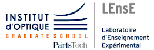

LEnsE Python package - Applications
###################################

This package is provided by the `LEnsE <https://lense.institutoptique.fr/>`_, the Experimental Teaching Laboratory of
the `Institut d'Optique Graduate School  <https://www.institutoptique.fr>`_.

How to install
==============

**Lensepy-app** can be installed from PyPI with pip:

.. code-block:: sh

    pip install lensepy-app

How to use
==========

**Lensepy-app** can be imported in your Python script:

.. code-block:: python

    import lensepy

For specific use, a documentation is available at this website:
`<https://iogs-lense.github.io/lensepy-app/>`_.
